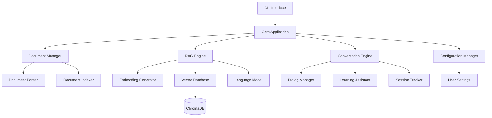

# Design Document

## Overview

문서 기반 RAG 영어 학습 CLI 프로그램은 사용자의 관심사 문서들을 RAG 시스템에 인덱싱하고, 이를 기반으로 자연스러운 대화형 영어 학습 경험을 제공하는 시스템입니다. 사용자는 자신이 관심 있는 주제에 대해 영어로 대화하면서 자연스럽게 영어 실력을 향상시킬 수 있습니다.

## Architecture

### High-Level Architecture



### Technology Stack

- **Language**: Python 3.8+
- **CLI Framework**: Click
- **Vector Database**: ChromaDB
- **Embeddings**: sentence-transformers
- **Language Model**: OpenAI GPT API, Google Gemini API, 또는 로컬 모델 (Ollama)
- **Document Processing**: 
  - PDF: PyPDF2
  - DOCX: python-docx
  - Text/Markdown: 내장 라이브러리
- **Configuration**: YAML
- **Data Storage**: SQLite (메타데이터), JSON (설정)

## Components and Interfaces

### 1. CLI Interface Layer

**CommandLineInterface**
```python
class CommandLineInterface:
    def __init__(self, app_core: ApplicationCore)
    def run(self) -> None
    def handle_command(self, command: str, args: List[str]) -> None
```

**Commands**:
- `setup`: 초기 설정 (문서 디렉토리, LLM, 모국어)
- `set-docs <directory>`: 문서 디렉토리 설정 및 인덱싱
- `set-llm <provider>`: LLM 제공업체 설정 (openai, gemini, ollama)
- `set-language <language>`: 모국어 설정
- `chat`: 관심사 기반 영어 학습 대화 시작
- `status`: 현재 설정 및 인덱싱 상태 확인
- `help`: 도움말

### 2. Core Application Layer

**ApplicationCore**
```python
class ApplicationCore:
    def __init__(self)
    def initialize(self) -> None
    def get_document_manager(self) -> DocumentManager
    def get_rag_engine(self) -> RAGEngine
    def get_conversation_engine(self) -> ConversationEngine
    def get_config_manager(self) -> ConfigurationManager
    def is_ready_for_chat(self) -> bool
```

### 3. Document Management Layer

**DocumentManager**
```python
class DocumentManager:
    def set_document_directory(self, directory_path: str) -> IndexingResult
    def index_documents(self, directory_path: str) -> IndexingResult
    def get_indexing_status(self) -> IndexingStatus
    def get_document_summary(self) -> DocumentSummary
```

**DocumentParser**
```python
class DocumentParser:
    def parse_file(self, file_path: str) -> Optional[Document]
    def extract_text_from_pdf(self, file_path: str) -> str
    def extract_text_from_docx(self, file_path: str) -> str
    def extract_text_from_txt(self, file_path: str) -> str
```

**Document**
```python
@dataclass
class Document:
    id: str
    title: str
    file_path: str
    content: str
    file_type: str
    created_at: datetime
    word_count: int
    language: str
```

### 4. RAG Engine Layer

**RAGEngine**
```python
class RAGEngine:
    def __init__(self, vector_db: VectorDatabase, llm: LanguageModel)
    def index_document(self, document: Document) -> None
    def search_similar_content(self, query: str, top_k: int = 5) -> List[SearchResult]
    def generate_answer(self, query: str, context: List[SearchResult]) -> str
    def extract_keywords(self, text: str) -> List[str]
```

**LanguageModel (Abstract Base)**
```python
class LanguageModel(ABC):
    @abstractmethod
    def generate_response(self, prompt: str, context: str = "") -> str
    @abstractmethod
    def translate_text(self, text: str, target_language: str) -> str
    @abstractmethod
    def analyze_grammar(self, text: str) -> GrammarAnalysis

class OpenAILanguageModel(LanguageModel):
    def __init__(self, api_key: str, model: str = "gpt-3.5-turbo")
    def generate_response(self, prompt: str, context: str = "") -> str
    def translate_text(self, text: str, target_language: str) -> str
    def analyze_grammar(self, text: str) -> GrammarAnalysis

class GeminiLanguageModel(LanguageModel):
    def __init__(self, api_key: str, model: str = "gemini-pro")
    def generate_response(self, prompt: str, context: str = "") -> str
    def translate_text(self, text: str, target_language: str) -> str
    def analyze_grammar(self, text: str) -> GrammarAnalysis

class OllamaLanguageModel(LanguageModel):
    def __init__(self, model: str = "llama2", host: str = "localhost:11434")
    def generate_response(self, prompt: str, context: str = "") -> str
    def translate_text(self, text: str, target_language: str) -> str
    def analyze_grammar(self, text: str) -> GrammarAnalysis
```

**VectorDatabase**
```python
class VectorDatabase:
    def add_document_chunks(self, doc_id: str, chunks: List[str]) -> None
    def search(self, query_embedding: List[float], top_k: int) -> List[SearchResult]
    def delete_document(self, doc_id: str) -> None
```

**EmbeddingGenerator**
```python
class EmbeddingGenerator:
    def generate_embedding(self, text: str) -> List[float]
    def generate_batch_embeddings(self, texts: List[str]) -> List[List[float]]
```

### 5. Conversation Engine Layer

**ConversationEngine**
```python
class ConversationEngine:
    def __init__(self, rag_engine: RAGEngine, llm: LanguageModel, config: Configuration)
    def start_conversation(self) -> ConversationSession
    def process_user_input(self, user_input: str, session: ConversationSession) -> ConversationResponse
    def end_conversation(self, session: ConversationSession) -> ConversationSummary
```

**DialogManager**
```python
class DialogManager:
    def generate_conversation_starter(self, document_topics: List[str]) -> str
    def maintain_conversation_flow(self, conversation_history: List[Message]) -> str
    def suggest_follow_up_questions(self, context: str) -> List[str]
```

**LearningAssistant**
```python
class LearningAssistant:
    def analyze_user_english(self, text: str) -> EnglishAnalysis
    def provide_corrections(self, text: str, errors: List[Error]) -> CorrectionSuggestion
    def explain_grammar_point(self, text: str, grammar_point: str) -> GrammarExplanation
    def suggest_vocabulary_improvements(self, text: str) -> VocabularyImprovement
```

**SessionTracker**
```python
class SessionTracker:
    def create_session(self) -> ConversationSession
    def update_session(self, session: ConversationSession, interaction: Interaction) -> None
    def save_session(self, session: ConversationSession) -> None
    def get_session_summary(self, session_id: str) -> ConversationSummary
```

### 6. Configuration Layer

**ConfigurationManager**
```python
class ConfigurationManager:
    def load_config(self) -> Configuration
    def save_config(self, config: Configuration) -> None
    def get_user_language(self) -> str
    def set_user_language(self, language: str) -> None
    def get_document_directory(self) -> Optional[str]
    def set_document_directory(self, directory: str) -> None
    def get_llm_provider(self) -> Optional[str]
    def set_llm_provider(self, provider: str, api_key: str = None) -> None
    def is_setup_complete(self) -> bool
    def get_setup_status(self) -> SetupStatus
```

## Data Models

### Core Data Models

```python
@dataclass
class ConversationSession:
    session_id: str
    start_time: datetime
    end_time: Optional[datetime]
    messages: List[Message]
    topics_covered: List[str]
    learning_points: List[LearningPoint]
    user_language: str

@dataclass
class Message:
    role: str  # user, assistant
    content: str
    timestamp: datetime
    metadata: Dict[str, Any]

@dataclass
class ConversationResponse:
    response_text: str
    learning_feedback: Optional[LearningFeedback]
    suggested_topics: List[str]
    context_sources: List[SearchResult]

@dataclass
class LearningFeedback:
    corrections: List[Correction]
    grammar_tips: List[GrammarTip]
    vocabulary_suggestions: List[VocabSuggestion]
    encouragement: str

@dataclass
class IndexingResult:
    success: bool
    documents_processed: int
    total_chunks: int
    processing_time: float
    errors: List[str]

@dataclass
class EnglishAnalysis:
    grammar_errors: List[GrammarError]
    vocabulary_level: str
    fluency_score: float
    suggestions: List[ImprovementSuggestion]

@dataclass
class SearchResult:
    content: str
    source_file: str
    relevance_score: float
    metadata: Dict[str, Any]
```

## Error Handling

### Error Types

1. **DocumentError**: 문서 처리 관련 오류
2. **RAGError**: RAG 엔진 관련 오류
3. **LearningError**: 학습 모듈 관련 오류
4. **ConfigurationError**: 설정 관련 오류
5. **ValidationError**: 입력 검증 오류

### Error Handling Strategy

```python
class ErrorHandler:
    def handle_error(self, error: Exception) -> None
    def log_error(self, error: Exception, context: Dict[str, Any]) -> None
    def get_user_friendly_message(self, error: Exception) -> str
```

- 모든 오류는 로그에 기록
- 사용자에게는 이해하기 쉬운 메시지 제공
- 시스템 복구 가능한 오류는 자동 재시도
- 치명적 오류는 안전한 종료 수행

## Testing Strategy

### Unit Testing
- 각 컴포넌트별 독립적인 단위 테스트
- Mock 객체를 사용한 의존성 격리
- 테스트 커버리지 90% 이상 목표

### Integration Testing
- RAG 엔진과 벡터 데이터베이스 통합 테스트
- 문서 인덱싱 파이프라인 테스트
- LLM 연동 테스트

### End-to-End Testing
- 전체 대화형 학습 워크플로우 테스트
- 다양한 문서 형식 처리 테스트
- 다국어 지원 테스트

### Performance Testing
- 대용량 문서 인덱싱 성능 테스트
- 실시간 대화 응답 시간 테스트
- 메모리 사용량 모니터링

### Test Data
- 샘플 문서 세트 (PDF, DOCX, TXT, MD)
- 다양한 주제의 대화 시나리오
- 다국어 학습 테스트 케이스

## Security Considerations

1. **API Key 보안**: 환경 변수를 통한 API 키 관리
2. **파일 시스템 보안**: 사용자 지정 디렉토리 접근 권한 검증
3. **입력 검증**: 모든 사용자 입력에 대한 검증 및 새니타이징
4. **데이터 암호화**: 민감한 학습 데이터의 로컬 암호화 저장

## Performance Optimization

1. **벡터 인덱싱**: 효율적인 벡터 검색을 위한 인덱스 최적화
2. **캐싱**: 자주 사용되는 임베딩과 번역 결과 캐싱
3. **배치 처리**: 대량 문서 처리 시 배치 단위 처리
4. **메모리 관리**: 대용량 문서 처리 시 스트리밍 방식 적용